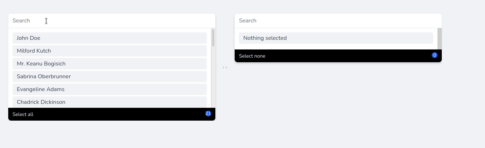

## Livewire Tailwind Side Select Component

Side select is a Livewire component which is inspired by  [Vuejs Sideselect](https://github.com/juliorosseti/vue-select-sides)




### Usage

```php
<livewire:side-select model="\App\Models\User" tracker="id" label="name"/>
```

Component creates two hidden inputs which you can use on your forms.

```html
<input type="hidden" name="selected" value="1,6,7,8,9,10,11,12,13,14,15,16,17,18,19,20,21">
<input type="hidden" name="not_selected" value="2,3,4,5">
```